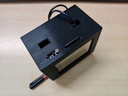

# flashwords
 Small Display that shows random words from a SD card. Useful for revision.

Libraries:
- [TFT_eSPI](https://github.com/Bodmer/TFT_eSPI)
- [RP2040_SD](https://github.com/khoih-prog/RP2040_SD) 

Hardware used:
- Raspberry Pi Pico
- ILI9341 2.8 inch display with SD card
- TP4056 Charging Module
- Lithium polymer battery

To add more words, copy them to the SD card. They need to be in similar format to that of the words in the folder 'word_examples'.

## Demo

https://user-images.githubusercontent.com/59861388/152161086-cd817524-0774-4ae2-88bc-2e3bf02d9e8f.mp4

### 3D Model
PS: Dimensions are not accurate. It works for me.

